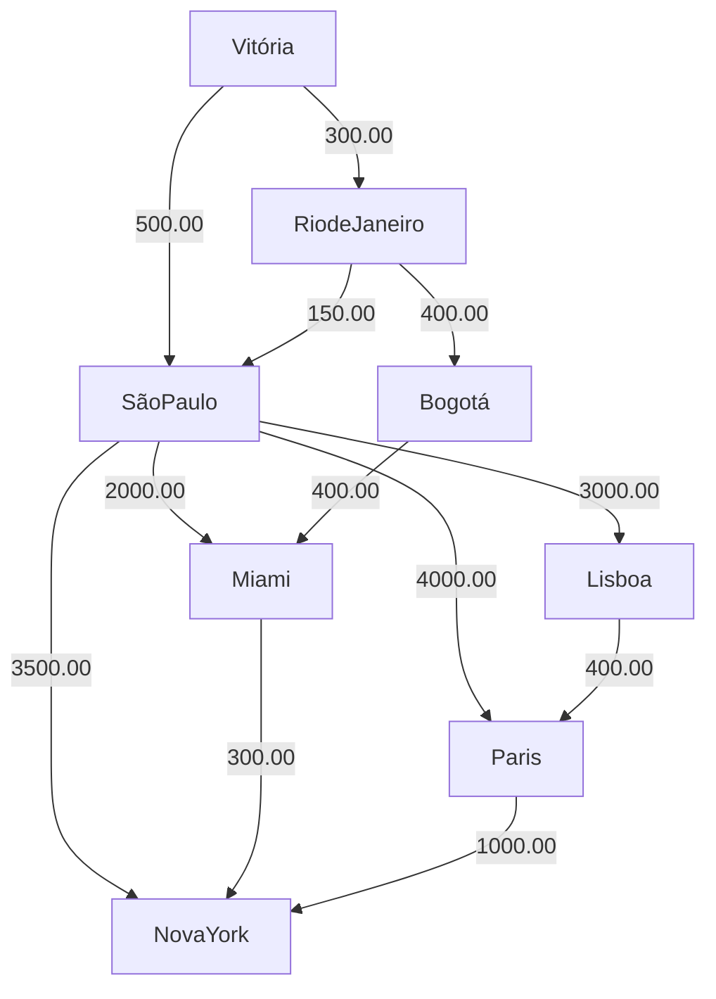
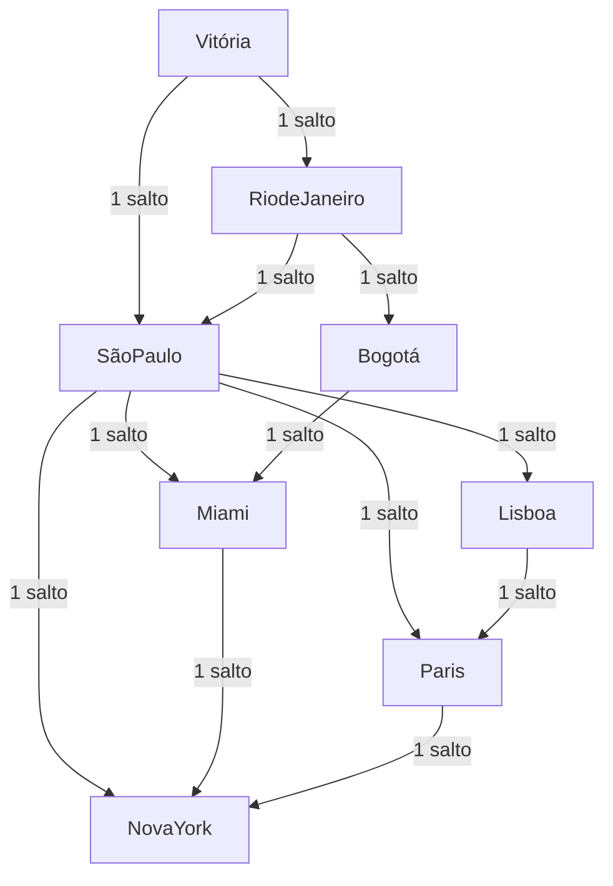

# Sistema de Planeamento de Voos (Grafos)

## 📖 Descrição

Este projeto consiste num sistema de planeamento de rotas aéreas desenvolvido como parte da disciplina de **Técnicas de Programação Avançada**. O objetivo é aplicar conceitos de **Teoria dos Grafos** para resolver problemas reais de roteamento, implementando algoritmos de caminho mínimo e busca de forma modular.

O software permite encontrar a rota **mais barata** (baseada em custos financeiros) e a rota **mais direta** (baseada no número de escalas), utilizando uma arquitetura em camadas para garantir a organização e a qualidade do código.

---

## 🛠 Tecnologias Utilizadas

- **Linguagem:** Java (versão 17 ou superior recomendada)
- **Estrutura de Dados:** Grafos implementados através de **Lista de Adjacências**
- **Arquitetura:** Baseada em camadas (Estrutura, Negócio e Interface)
- **IDE:** IntelliJ IDEA

---

## 🚀 Funcionalidades

- **Carregamento via Arquivo:** Importação automática da malha aérea a partir de um ficheiro `voos.txt`
- **Algoritmo de Dijkstra:** Cálculo da rota de menor custo financeiro
- **Busca em Largura (BFS):** Cálculo da rota com o menor número de escalas (saltos)
- **Visualização da Malha:** Impressão da lista de adjacências completa no terminal para auditoria de dados

---

## 📊 Representação Técnica (Mermaid)

Para validar a estrutura de dados, o sistema utiliza dois grafos em memória com a mesma topologia, mas focados em objetivos diferentes:

### 1. Grafo Financeiro (Dijkstra)

Focado no custo real das arestas (preço em R$).



### 2. Grafo de Conexões (BFS)

Focado na contagem de saltos (pesos normalizados para `1.0`).



> **Nota:** Esta representação ilustra como o mesmo conjunto de dados gera resultados distintos dependendo do algoritmo aplicado (custo vs. proximidade).

---

## 📂 Arquitetura do Projeto

O projeto está organizado para separar responsabilidades:

| Arquivo | Camada | Responsabilidade |
|---|---|---|
| `Grafo.java` | Estrutura | Biblioteca genérica de grafos |
| `GerenciadorVoos.java` | Negócio | Processamento da malha aérea e orquestração de buscas |
| `Main.java` | Interface | Menu do usuário e exibição de resultados |

---

## 📋 Como Executar

### Pré-requisitos

1. Ter o Java JDK instalado
2. Clonar este repositório ou baixar os arquivos fonte

### Execução

1. Certifique-se de que o ficheiro `voos.txt` está na mesma pasta dos ficheiros `.java`

2. Compile os ficheiros:

```bash
javac *.java
```

3. Execute o programa:

```bash
java Main
```

### Formato do `voos.txt`

O sistema espera um ficheiro de texto simples com o formato `Origem;Destino;Preço`:

```
Vitória;São Paulo;500.00
São Paulo;Nova York;3500.00
```

---

## 👨‍🏫 Notas de Apresentação

- **Desafio Matemático:** O sistema foi desenhado para que a rota com menos escalas seja diferente da rota mais barata, comprovando a eficácia dos algoritmos aplicados.
- **Complexidade:** A implementação de Dijkstra utilizada possui complexidade $\mathcal{O}(V^2)$, otimizada para a estrutura didática de grafos esparsos em memória.
